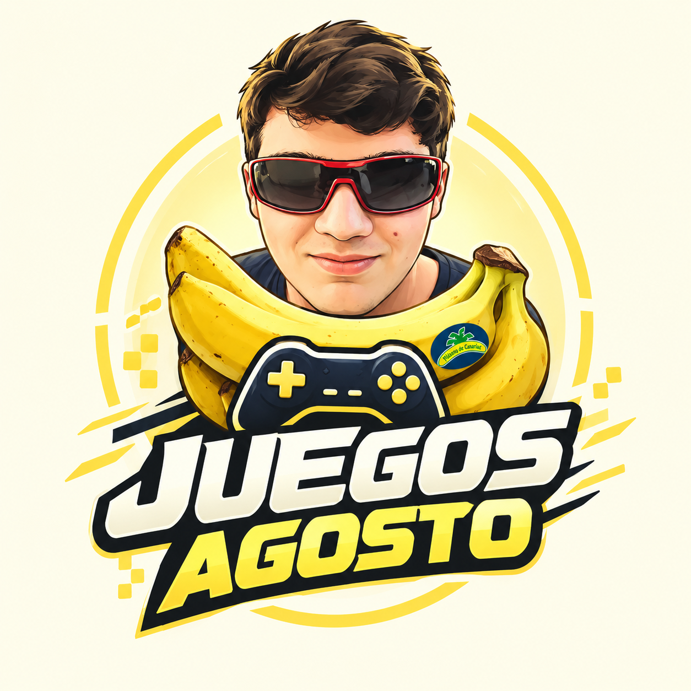

# 🕹️ Proyecto Gitflow - Juegos Agosto

---

## 🫂 Equipo de desarrollo
😁 [Pablo Santos Vázquez](https://github.com/PabloSantosVazquez)
⚡ [Daniel Dario Vazquez Tripodoro](https://github.com/danield-odaw1b)
🚀 [Hector Pallas Varona](https://github.com/HPallas)
😌 [Iria Sanchez Dafonte](https://github.com/IriaWirtz)
🥸 [Franco Ismael Raguza](https://github.com/francoismaelraguza)

---

## 🎯 Tema del proyecto
Juegos Agosto es una tienda de videojuegos donde los jugadores podran ir mas alla de los tipicos lanzamientos AAA, ofreciendole a nuestros clientes experiencias innovadoras e historias increibles.

---

## 📁 Estructura del proyecto
(Indicar qué páginas HTML habéis creado además del index.html)

- index.html
- 
- 
- 

---

## 🧩 Funcionalidades implementadas (features)

- feature/

---

## 👨‍💻 Contribución de cada miembro
(Indicar qué ha hecho cada persona en el proyecto)

- Nombre: 
  - Features en las que ha trabajado:
  - Archivos modificados:

- Nombre: 
  - Features en las que ha trabajado:
  - Archivos modificados:

---

## 🚀 Versión del proyecto

Versión: **v0.0.0**

---

## 🔗 Enlaces

- 😺[Repositorio GitHub](https://github.com/HPallas/Juegos-Agostos) 
- ⚙️[Link de trello](https://trello.com/b/QNVFya4E/gitflow-trabajo) 

---

## 📝 Problemas encontrados

---
